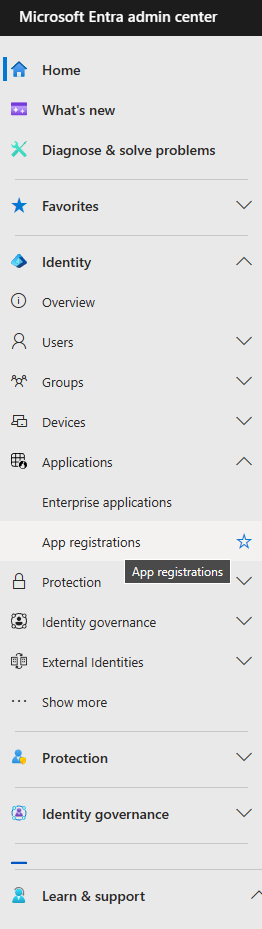

# OAUTH2 Guide

## Overview
This document provides guidelines on integration of OAUTH2 authorization into a streamlit application. Specifically, it covers the integration of Google and Microsoft OAUTH2 authentications.

## Microsoft
Microsoft authenticators are managed on [Microsoft Entra](https://entra.microsoft.com/) platform. 

First, create an account on [Microsoft Entra](https://entra.microsoft.com/). Then proceed with the next steps.

### Registering app 

<TABLE style="border: none;">
<TBODY>
<TR>
<TD>1. In the Entra <b style="color:#1167b1">Admin Center sidebar</b>(see <b>Figure 1</b>) , navigate to <b style="color:#1167b1">App registration</b>.<br><br>
2. Click on <b style="color:#1167b1">New Registration</b>. <br><br>3. Provide a unique application name.<br><br>4. Select <t style="color:#1167b1">Accounts in this organizational directory only</t> option. <br><br>
5. <b style="color:red">DO NOT </b> provide redirect URIs
<br><br>
6. Click <b style="color:#1167b1">Register</b>. You will be redirected to the App's dashboard<br><br>
7. Navigate to <b style="color:#1167b1">Authentication</b><br><br>
8. Click <b style="color:#1167b1">Add a platform</b>. Select  <t style="color:#1167b1">Mobile and desktop application</t>.In custom redirect URIs type in <code>http://localhost</code>. Press  <b style="color:#1167b1">Configure</b>.<br><br>
9. Go back to the  <b style="color:#1167b1">App Overview</b>. Copy  <t style="color:#1167b1">Application (Client) ID</t> and <t style="color:#1167b1">Directory (Tenant) ID</t>


</TD>
<TD></img><br><i>Figure 1: Microsoft Entra Admin Sidebar</i></TD>
</TR>
</TBODY>
</TABLE>

### Python implementation
We are using [Streamlit's OAUTH library](https://github.com/dnplus/streamlit-oauth) for Python implementation.

First, we are creating a Streamlit OAUTH component instance where we provide previously copied __client id__ and endpoints with __tenant id__.

```python
from streamlit_oauth import OAuth2Component

msal_oauth2 = OAuth2Component(
    client_id=MSAL_CLIENT_ID, 
    authorize_endpoint=f"https://login.microsoftonline.com/{MSAL_TENANT_ID}/oauth2/v2.0/authorize?", 
    token_endpoint=f"https://login.microsoftonline.com/{MSAL_TENANT_ID}/oauth2/v2.0/token?")
```
Next, we create an authorization button which will trigger the authorization procedure
```python
msal_oauth2.authorize_button(
            # Button text
            name="Continue with Microsoft", 
            # Button icon
            icon="https://learn.microsoft.com/en-us/entra/identity-platform/media/howto-add-branding-in-apps/ms-symbollockup_mssymbol_19.png",
            # Make redirect URI the same as the one used for 
            # hosting Streamlit app
            redirect_uri="http://localhost:8501",
            # Copy this exact scope
            scope="User.ReadBasic.All",
            # Unique identifier
            key="microsof",
            # Recommended settings
            extras_params={"prompt": "consent", "access_type": "offline"},
            use_container_width=True,
            pkce='S256',
        )
```

## Google
Google OAUTH2 authenticators are managed on [Google Cloud](https://console.cloud.google.com/) platform. 
### Registering app
1. Register on [Google Cloud](https://console.cloud.google.com/)
2. Create a <b style="color:#1167b1">New Project</b>
3. Once the project is set up, go to its <b style="color:#1167b1">Credentials</b> page.
4. Press <b style="color:#1167b1">Configure Consent Screen</b>
5. Select <b style="color:#1167b1">External User Type</b> . Press <b style="color:#1167b1">Create</b>.
6. Fill in the form. Use domains that are  the same as the one used for hosting Streamlit app (i.e. `http://localhost`). You can add more domains later. 
7. Press <b style="color:#1167b1">Save and Continue</b>.
8. Go to <b style="color:#1167b1">Credentials</b>.
9. Press <b style="color:#1167b1">Create credentials</b>. Select <b style="color:#1167b1">OAuth Client ID</b>.
10. Select <b style="color:#1167b1">Web application</b>. Provide a name and a redirect URI which is the same as the one used for hosting Streamlit app (i.e. `http://localhost`). You can add more domains later.
11. Press <b style="color:#1167b1">Create</b>.
12. The pop-up will appear offering to download the <t style="color:#1167b1">client secret json file</t>. Download it.


### Python implementation
The procedure is similar to [Microsoft OAuth implementation](#python-implementation). 

The OAuth2Componet's input is various fields from the <t style="color:#1167b1">client secret json file</t> downloaded earlier.
```python
from streamlit_oauth import OAuth2Component

GOOG_AUTHORIZE_ENDPOINT = "https://accounts.google.com/o/oauth2/v2/auth"
GOOG_TOKEN_ENDPOINT = "https://oauth2.googleapis.com/token"
GOOG_REVOKE_ENDPOINT = "https://oauth2.googleapis.com/revoke"

goog_oauth2 = OAuth2Component(
    GOOG_CLIENT_ID, # client_id 
    GOOG_CLIENT_SECRET, # client_secret 
    GOOG_AUTHORIZE_ENDPOINT, # auth_uri
    GOOG_TOKEN_ENDPOINT,  # token endpoint
    GOOG_TOKEN_ENDPOINT,  # refresh token endpoint
    GOOG_REVOKE_ENDPOINT 
    )
```
Next, we create an authorization button which will trigger the authorization procedure
```python
goog_oauth2.authorize_button(
            # Button text
            name="Continue with Google",
            # Button icon            
            icon="https://www.google.com.tw/favicon.ico",
            # Make redirect URI the same as the one used for 
            # hosting Streamlit app
            redirect_uri="http://localhost:8502",
            # Copy this exact scope
            scope="openid email profile",
            # Unique identifier
            key="google",
            # Recommended settings
            extras_params={"prompt": "consent", "access_type": "offline"},
            use_container_width=use_container_width,
            pkce='S256',
        )
```